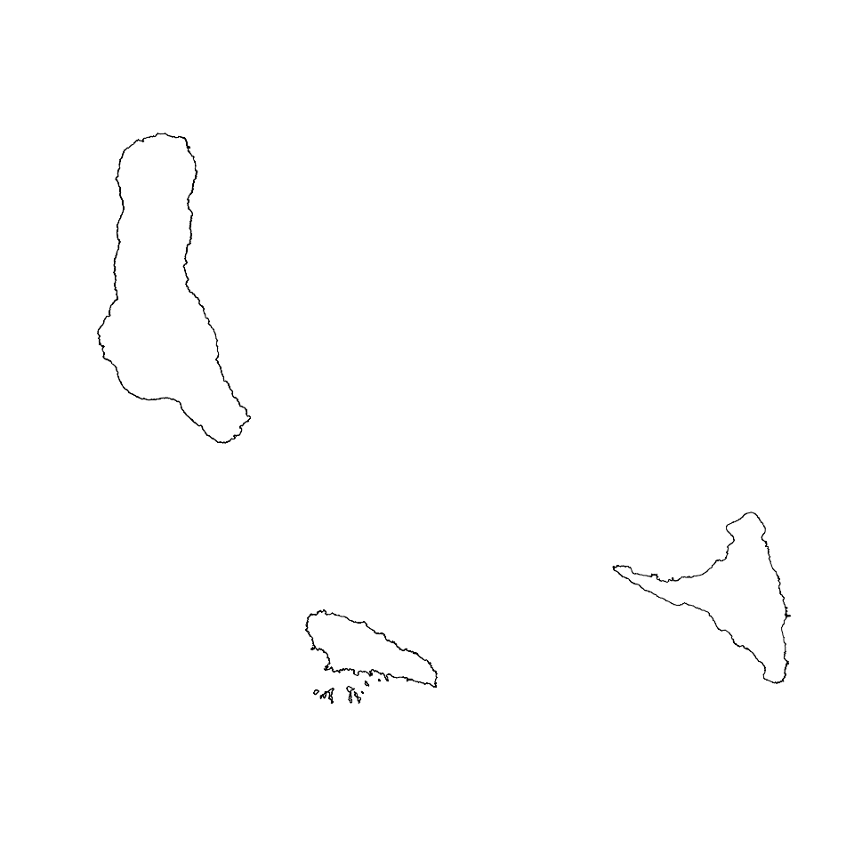
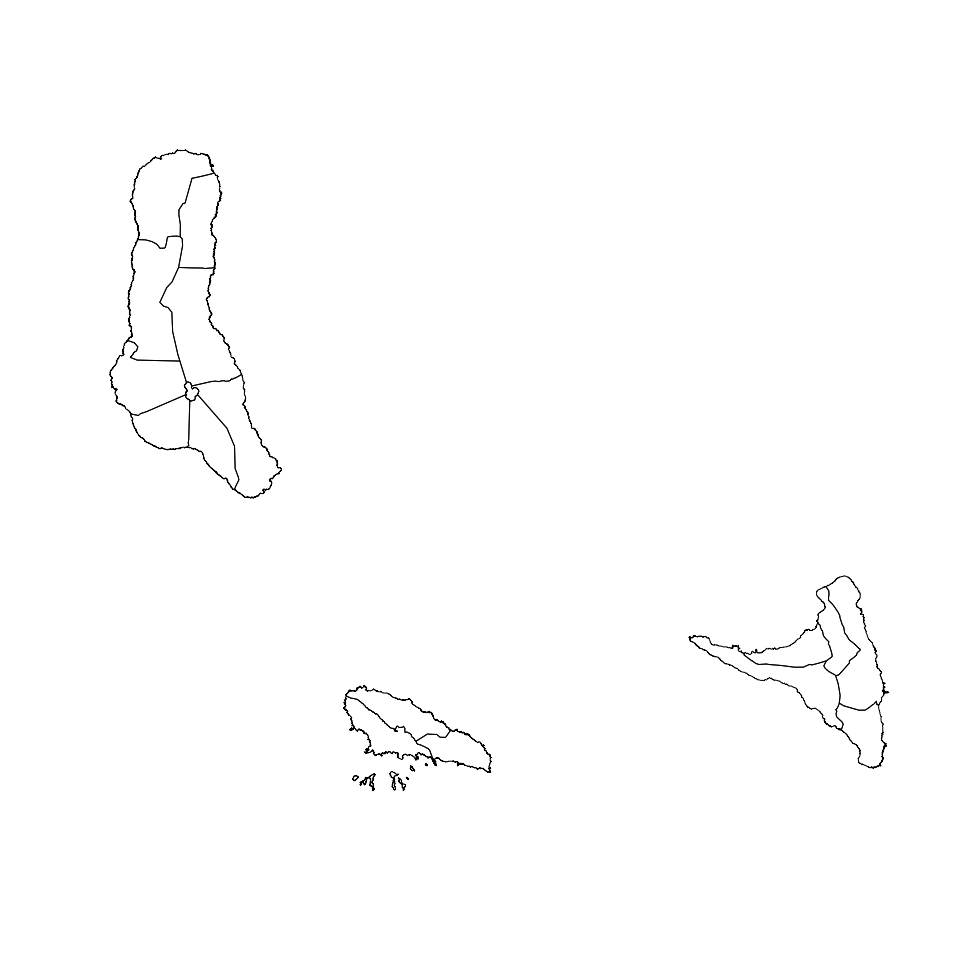
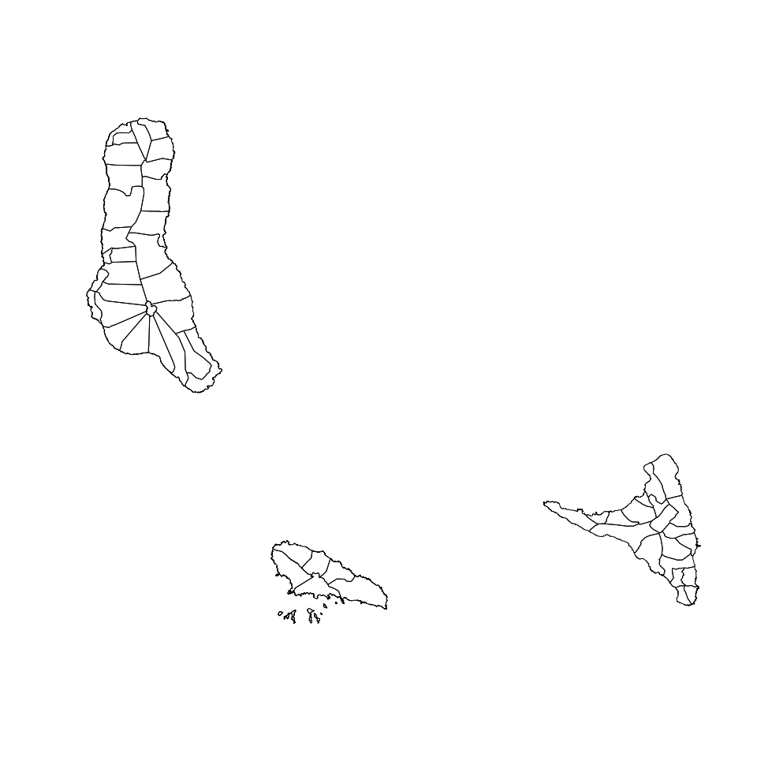
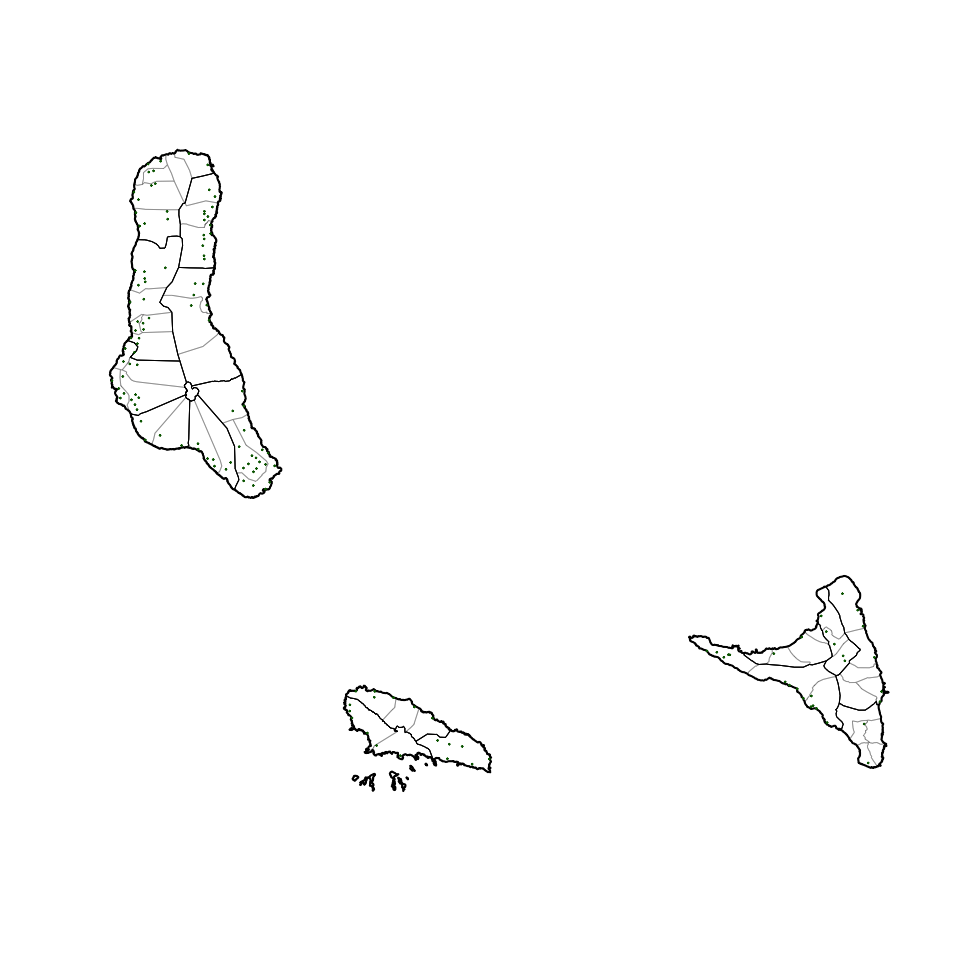

<!-- README.md is generated from README.Rmd. Please edit that file -->

# comoros: Datasets for use in designing surveys in the Comoros Union 

<!-- badges: start -->

[](https://www.tidyverse.org/lifecycle/#maturing)
[](https://travis-ci.org/spatialworks/comoros)
[](https://ci.appveyor.com/project/spatialworks/comoros)
[](https://www.codefactor.io/repository/github/spatialworks/comoros)
<!-- badges: end -->

Designing surveys require relevant datasets to be used as basis for
sample size calculations, sampling design, survey planning/logistics and
survey implementation. These include datasets on population, lists of
sampling clusters, map datasets for spatial sampling, and previous
survey datasets that can be used for estimating indicator variance and
design effects. This package contains relevant datasets for use in
designing surveys in the Comoros Union.

## Installation

The `comoros` package is not yet released on
[CRAN](https://CRAN.R-project.org). The development version of the
package can be installed from [GitHub](https://github.com/) with:

``` r
if(!require(remotes)) install.packages("remotes")
remotes::install_github("spatialworks/comoros")
```

## Usage

When installing `comoros`, geospatial packages on which `comoros`
depends on are also installed. To use `comoros` package, it will be
important to load these package dependencies that have been installed.
This can be done by:

``` r
library(rgdal)
library(rgeos)
library(raster)
```

### Country borders

The Comoros country borders `SpatialPolygonsDataFrame` is accessed via
the `country` dataset.

``` r
comoros::country
#> class       : SpatialPolygonsDataFrame 
#> features    : 1 
#> extent      : 43.22856, 44.54067, -12.42278, -11.36528  (xmin, xmax, ymin, ymax)
#> crs         : +proj=longlat +datum=WGS84 +no_defs +ellps=WGS84 +towgs84=0,0,0 
#> variables   : 10
#> names       :    Shape_Leng,     Shape_Area,       ADM0_EN, ADM0_PCODE, ADM0_REF, ADM0ALT1EN, ADM0ALT2EN,       date,    validOn, validTo 
#> value       : 4.80449064527, 0.137199933487, Comoros (the),         KM,       NA,         NA,         NA, 2018/12/28, 2019/12/05,      NA
```

The country borders of the Comoros can be plotted by:

``` r
sp::plot(comoros::country)
```



### Island borders

The Comoros island borders `SpatialPolygonsDataFrame` is accessed via
the `island` dataset.

``` r
comoros::island
#> class       : SpatialPolygonsDataFrame 
#> features    : 3 
#> extent      : 43.22856, 44.54067, -12.42278, -11.36528  (xmin, xmax, ymin, ymax)
#> crs         : +proj=longlat +datum=WGS84 +no_defs +ellps=WGS84 +towgs84=0,0,0 
#> variables   : 12
#> names       :    Shape_Leng,      Shape_Area,            ADM1_EN, ADM1_PCODE,       ADM1_REF, ADM1ALT1EN, ADM1ALT2EN,       ADM0_EN, ADM0_PCODE,       date,    validOn, validTo 
#> min values  : 1.36498298028, 0.0174328080224, Anjouan (Ndzouani),        KM1, Moheli (Mwali),         NA,         NA, Comoros (the),         KM, 2018/12/28, 2019/12/05,      NA 
#> max values  : 2.07398441062, 0.0842847607715,     Moheli (Mwali),        KM3, Moheli (Mwali),         NA,         NA, Comoros (the),         KM, 2018/12/28, 2019/12/05,      NA
```

The island borders of the Comoros can be plotted by:

``` r
sp::plot(comoros::island)
```


### Prefecture borders

The Comoros prefecture borders `SpatialPolygonsDataFrame` is accessed
via the `prefecture` dataset.

``` r
comoros::prefecture
#> class       : SpatialPolygonsDataFrame 
#> features    : 17 
#> extent      : 43.22856, 44.54067, -12.42278, -11.36528  (xmin, xmax, ymin, ymax)
#> crs         : +proj=longlat +datum=WGS84 +no_defs +ellps=WGS84 +towgs84=0,0,0 
#> variables   : 14
#> names       :      Shape_Leng,      Shape_Area, ADM2_EN, ADM2_PCODE,           ADM2_REF, ADM2ALT1EN, ADM2ALT2EN,            ADM1_EN, ADM1_PCODE,       ADM0_EN, ADM0_PCODE,       date,    validOn, validTo 
#> min values  : 0.0966248392692, 0.0004527146025,  Djando,       KM11, Mitsamiouli-Mboude,         NA,         NA, Anjouan (Ndzouani),        KM1, Comoros (the),         KM, 2018/12/28, 2019/12/05,      NA 
#> max values  :   1.00539489321,  0.014594533592,    Sima,       KM33,            Mremani,         NA,         NA,     Moheli (Mwali),        KM3, Comoros (the),         KM, 2018/12/28, 2019/12/05,      NA
```

The prefecture borders of the Comoros can be plotted by:

``` r
sp::plot(comoros::prefecture)
```



### Commune borders

The Comoros commune borders `SpatialPolygonsDataFrame` is accessed via
the `commune` dataset.

``` r
comoros::commune
#> class       : SpatialPolygonsDataFrame 
#> features    : 55 
#> extent      : 43.22856, 44.54067, -12.42278, -11.36528  (xmin, xmax, ymin, ymax)
#> crs         : +proj=longlat +datum=WGS84 +no_defs +ellps=WGS84 +towgs84=0,0,0 
#> variables   : 16
#> names       :      Shape_Leng,        Shape_Area, ADM3_EN, ADM3_PCODE,          ADM3_REF, ADM3ALT1EN, ADM3ALT2EN, ADM2_EN, ADM2_PCODE,            ADM1_EN, ADM1_PCODE,       ADM0_EN, ADM0_PCODE,       date,    validOn, ... 
#> min values  : 0.0966248392692, 0.000442750529473,    Adda,      KM111, Cembenoi Lac Sale,         NA,         NA,  Djando,       KM11, Anjouan (Ndzouani),        KM1, Comoros (the),         KM, 2018/12/28, 2019/12/05, ... 
#> max values  :  0.758187096198,  0.00602115613753,  Vouani,      KM332,         Ngandzale,         NA,         NA,    Sima,       KM33,     Moheli (Mwali),        KM3, Comoros (the),         KM, 2018/12/28, 2019/12/05, ...
```

The commune borders of the Comoros can be plotted by:

``` r
sp::plot(comoros::commune)
```



### Populated places

Populated places in the Comoros can be accessed via the `ppl` dataset
which is in a `SpatialPointsDataFrame` format.

``` r
comoros::ppl
#> class       : SpatialPointsDataFrame 
#> features    : 144 
#> extent      : 43.23215, 44.52885, -12.37829, -11.37155  (xmin, xmax, ymin, ymax)
#> crs         : +proj=longlat +datum=WGS84 +no_defs +ellps=WGS84 +towgs84=0,0,0 
#> variables   : 6
#> names       :     osm_id,             is_in,                       source,   place,  population,            name 
#> min values  :  339324562,           Anjouan,             #opendri-comoros,    city, 1000 a 3000, Akibani أكيباني 
#> max values  : 7228442367, Moya;Sima;Anjouan, US NGA Pub. 112. 2010-11-10., village,        8000,   واناني Wanani
```

The populated places dataset can be laid over the country borders as
follows:

``` r
sp::plot(comoros::commune, lwd = 0.5, border = "gray50")
sp::plot(comoros::prefecture, add = TRUE)
sp::plot(comoros::country, lwd = 2, add = TRUE)
sp::plot(comoros::ppl, cex = 0.3, pch = 20, col = "darkgreen", add = TRUE)
```


